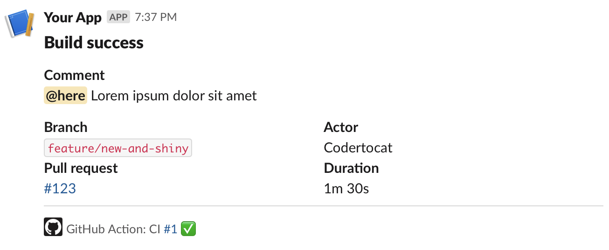

# Post Slack Message action

This action posts an enriched Slack message to a given channel.



## Inputs

### `github_token`
**Required** A GitHub token used to enrich the Slack message. Defaults to the one provided by the GitHub action context.

### `slack_token`
**Required** Slack authentication token bearing required scopes.

Example
```
xxxx-xxxxxxxxx-xxxx
```

### `channel`
**Required** Channel, private group, or IM channel to send message to. Can be an encoded ID, or a name. 

Example
```
C1234567890
```

### `status`
**Required** The current status of the job. Defaults to the one provided by the context.

Possible values: `success`, `failure`, `cancelled`

### `mention`
A trigger word that should be used to mention a channel, a team or a user ([Reference](https://api.slack.com/reference/surfaces/formatting#mentioning-users)). When the [`text`](#text) input uses a "fake headline" (see below), the mention is injected after the newline of the first fake headline.

Example: `here` to mention the channel or `subteam^SAZ94GDB8` to mention a user group with the ID _SAZ94GDB8_.

### `if_mention`
A condition when the mention should be applied. The value can be success, failure, cancelled or always. Multiple conditions can be separated with a comma.

Example: `success,failure`

### `fields`
A list of fields that should be used to enrich the message. Not all fields might be available, e.g. if a workflow has been started with the workflow_dispatch event, it might not be possible to fetch data related to a PR. If you specify more than one field, please separate them with a comma, e.g. `commit,repo`.

Possible fields are: `repo`, `message`, `commit`, `actor`, `job`, `duration`, `eventName`, `ref`, `pr`, `workflow`.

To use all fields, you can pass `all` to this input.

### `text`
A message that can be formatted using [Slack's mrkdwn format](https://api.slack.com/reference/surfaces/formatting). By using mrkdwn, you can also achieve "fake headlines" with bold text and newlines (see example below). This input is optional if a 'header' or 'custom_blocks' input is provided. In case one of the mentioned inputs is provided as well, the 'text' will be used as fallback and as the text displayed in notifications.

Example
```
*Comment*\nThis is a comment.
```

### `header`
A header, displayed at the top of the Slack message. Supports Slack's colon emoji syntax `:tada:`.

### `changelog`
A changelog, which will be displayed within the message.

### `buttons`
A list of buttons, using new lines as separator. Each line has the format `title|url`. It is also possible to change the style of the button by inserting a style of [Slack's Button Element](https://api.slack.com/reference/block-kit/block-elements#button) between the `title` and the `url`, e.g. `title|style|url`.

Example: `Download|https://example.com/file.zip`

### `custom_blocks`
A JSON-based array of structured blocks. Setting this property will only send the custom blocks and `text` if any was provided. See [Slack Block Kit Builder](https://app.slack.com/block-kit-builder) for more information.

Example
```json
[
    {
        "type": "section",
        "text": {
            "type": "mrkdwn",
            "text": "Hello, Assistant to the Regional Manager Dwight! *Michael Scott* wants to know where you'd like to take the Paper Company investors to dinner tonight.\n\n *Please select a restaurant:*"
        }
    }
]
```

## Example usage

This example results in a message as visible in the screenshot above.

```yml
- name: Post to slack
  uses: Sixt/action-slack-message@v1
  with:
    slack_token: ${{ secrets.SLACK_TOKEN }}
    channel: C1234567890
    fields: ref,actor,pr,duration
    header: "Build ${{ job.status }}"
    text: "*Comment*\n${{ steps.some-previous-step.outputs.comment }}"
```
